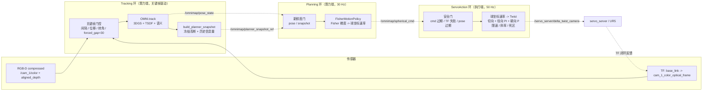

<p align="center">
<h1 align="center"><strong>OmniMap + FisherRF：机械臂主动视角感知闭环建图</strong></h1>
</p>

<p align="center">
  <a href="https://omni-map.github.io/" target='_blank'>
    
  </a>
</p>

## 这个仓库是什么

这个仓库以 [OmniMap](https://omni-map.github.io/)（光学 3DGS + 几何 TSDF + 开放词汇语义的在线建图框架）作为**建图后端**，
引入 [FisherRF](https://arxiv.org/abs/2311.17874) 的信息增益（Fisher information）作为**视角评价准则**，
搭建了一套**机械臂主动视角感知的闭环建图系统**：机械臂一边建图，一边根据当前地图的信息增益梯度自己决定下一步往哪看。

整条链路分两个阶段落地：

1. **仿真闭环**（`sim/`）：点云驱动的单进程闭环，验证「Fisher 梯度 → 速度指令 → 位姿积分 → 重新建图」这一环能收敛，效果可用。
2. **真机闭环**（`info_flow/`）：UR5 + RealSense + ROS Noetic。仿真里成立的串行结构在真机上直接失效，
   最终把系统拆成 **Tracking / Planning / ServoAction 三个独立控制环路**，才拿到实时闭环控制。

下面这一节是这个仓库相对上游 OmniMap 最主要的改动来源，也是读代码时最该先理解的部分。

## 为什么要拆成三个环路

### 真机上暴露的问题

仿真里的闭环是**串行单进程**的：拿一帧 → 建图 → 算 Fisher 梯度 → 出速度 → 下一帧。
这在仿真里没问题，因为「时间」是脚本自己推进的，建图慢一点只是仿真步进慢一点。

真机上时间不会等人，于是暴露出两个问题：

1. **建图与执行速度不一致**。`OMNI.track(...)` 单帧要做 3DGS 优化 + TSDF 融合 + 语义融合，
   耗时远高于伺服控制需要的周期。串行结构下控制指令的发布频率被建图拖到个位数 Hz，
   机械臂收到的是**基于过时地图算出来的过时速度**，表现为运动断续、跟不上、超调。
2. **奇异点局部锁死**。控制量更新太慢时，相机容易停在半球坐标的退化位置（`phi` 接近极点）
   或 Fisher 梯度的局部平坦区，速度指令来回抖动但净位移接近零，整个系统卡在原地不动。
   两个失效现象的录屏在本地 `videos/`（`奇异点锁死.mkv`、`局部循环.mkv`，该目录不入版本库）。

### 解决方式：按「更新频率」切分，而不是按「功能」切分

三个环路的划分依据是**各自状态的自然更新频率**，让慢的东西不阻塞快的东西：

| 环路 | 入口 | 频率 | 职责 | 运行位置 |
| --- | --- | --- | --- | --- |
| **Tracking** | [info_flow_tracking_node.py](info_flow/info_flow_tracking_node.py) | 关键帧驱动（数 Hz） | 关键帧门控 → `OMNI.track` → 构建地图快照 | 算力端（GPU） |
| **Planning** | [info_flow_planning_node.py](info_flow/info_flow_planning_node.py) | 固定 30 Hz | 用「最新位姿 + 最新地图快照」算 Fisher 梯度，输出球坐标角速率 | 算力端（GPU） |
| **ServoAction** | [info_flow_servo_runtime.py](info_flow/info_flow_servo_runtime.py) | 固定 50 Hz | 本机 TF 闭环，把球坐标速率转成 `TwistStamped` | 执行端（机器人主机，无 GPU） |

关键设计点：

- **Planning 不等 Tracking**。Tracking 完成一次建图后，把冻结的地图状态写成
  [PlannerSnapshot](info_flow/planner_snapshot.py) 文件，只在 ROS 上发一个
  `PlannerSnapshotRef`（`run_id / model_version / snapshot_uri`），不传大对象。
  Planning 按自己的节奏跑，地图版本没更新就继续用旧快照，**永远不会因为建图慢而停止出指令**。
- **Servo 不依赖 GPU**。Planning 输出的是球坐标速率（`theta_rate / phi_rate / reference_radius /
  reference_scene_center`）这种**与具体位姿无关的中间量**，最终的笛卡尔速度由执行端用**本机 TF**
  实时换算。执行端只需要 `rospy / tf2_ros / numpy / scipy / omnimap_msgs`，
  不装 `torch`，不加载 3DGS，见 [docs/execution_side_setup.md](docs/execution_side_setup.md)。
- **锁死主要靠提高控制率解决**，其余是配套手段：Fisher 梯度做 `log1p(|grad| / N_gaussians)` 归一化，
  避免高斯球数量增长导致的步长尺度漂移；梯度模长低于 `spherical_speed_min` 时策略主动发 stop，
  不在平坦区反复抖动；执行端有线速度 / 径向速度 / 角速度三处独立限幅、加速度斜率限幅和死区，
  抑制指令突变造成的来回振荡。
  （注意：`motion_policy` 里的 `phi_min/phi_max` 夹紧与 `max_theta_rate/max_phi_rate` 限幅只作用在
  位姿积分分支，也就是仿真用的那条路径；在线 `spherical_rate` 输出分支不经过它们，
  角度约束实际由执行端的机械臂工作空间与 `spatial_bounds` 承担。）
- **每一环都能独立降级为零速**。任一环的输入不新鲜（缺位姿 / 位姿过期 / 缺快照 / 快照加载失败 /
  指令过期 / TF 查询失败 / 策略主动 stop），对应环路立刻输出零速或 stop，不会带着陈旧状态继续运动。

### 三环数据流



完整的分支细节（每个安全门的具体条件、降级路径）见 [docs/info_flow.md](docs/info_flow.md)。

## ROS 接口约定

**订阅**（Tracking 环）

| 话题 | 类型 |
| --- | --- |
| `/cam_1/color/image_raw/compressed` | `sensor_msgs/CompressedImage` |
| `/cam_1/aligned_depth_to_color/image_raw/compressed` | `sensor_msgs/CompressedImage` |
| `/cam_1/color/camera_info` | `sensor_msgs/CameraInfo` |
| TF `base_link -> cam_1_color_optical_frame` | 按图像时间戳查询 |

**环间话题**（自定义消息在 [ros_ws/src/omnimap_msgs/](ros_ws/src/omnimap_msgs/)）

| 话题 | 类型 | 方向 |
| --- | --- | --- |
| `/omnimap/pose_state` | `geometry_msgs/PoseStamped` | Tracking → Planning |
| `/omnimap/planner_snapshot_ref` | `omnimap_msgs/PlannerSnapshotRef` | Tracking → Planning |
| `/omnimap/spherical_cmd` | `omnimap_msgs/SphericalCommand` | Planning → Servo |

**输出**

| 话题 | 类型 |
| --- | --- |
| `/servo_server/delta_twist_camera` | `geometry_msgs/TwistStamped` |

`SphericalCommand` 的字段设计是三环解耦的关键——它只携带**与执行端位姿无关**的量：

```
uint32   model_version          # 对应的地图快照版本
float64  theta_rate, phi_rate   # 球面切向角速率
float64  reference_radius       # 目标半径（径向 PI 的设定值）
float64[3] reference_scene_center
float64  fisher_score
bool     should_stop
string   stop_reason
```

## Fisher 信息增益与速度指令

### 信息增益怎么算

评价器在 [omnimap/gaussian/renderer/nbv/](omnimap/gaussian/renderer/nbv/)，当前运行时用的是
`legacy_fisher.py::LegacyFisherEvaluator`（`diag_fisher.py` 里的 `DiagFisher / LogFisher /
LogSquareFisher` 是同一父类下不同统计形式的变体，通过 [gs_backend.py:25](omnimap/gs_backend.py#L25) 的
import 切换）。

单视角打分沿用 FisherRF 的思路，用渲染图对高斯参数的梯度平方近似 Fisher 对角：

- 只统计 `xyz` 与 `opacity` 两组参数的梯度（`GaussianModel.cal_cur_hessian`）
- 历史信息量 = 所有关键帧视角的累加
- 当前视角得分 = `sum( cur_stat / (history_stat + λ) )`，即「这个视角能带来多少还没被观测过的信息」

历史信息量的累加放在 **Tracking 环**里做（`build_planner_snapshot` 时一次性算完并冻结进快照），
Planning 环直接用 `set_precomputed_history_stat` 注入的缓存，不重复遍历关键帧——这是把 Planning
压进 30 Hz 的主要手段之一。

### 从信息增益到速度

策略实现在 [motion_policy.py](omnimap/gaussian/renderer/nbv/motion_policy.py)：

1. 在当前视角对 `(theta, phi)` 做中心差分，得到 `dF/dtheta`、`dF/dphi`（`grad_eps` 控制步长）
2. 梯度归一化：`sign(g) * log1p(|g| / N_gaussians)`，消除高斯球数量增长带来的尺度漂移
3. 归一化梯度 × `fisher_step_scale` → **切向**球坐标速率；模长低于 `spherical_speed_min` 则发 stop
4. Planning 发布球坐标速率；Servo 端用本机 TF 得到当前 `(radius, theta, phi)` 后合成笛卡尔速度：
   - 切向：`v_t = radius * (theta_rate * e_theta + phi_rate * e_phi)`
   - 径向：`radial_error = reference_radius - radius` 走 **PI 控制**（带抗积分饱和、积分限幅、独立速度限幅）
   - 角速度：期望姿态由 `look_at_c2w(current_position, reference_scene_center)` 给出（注视参考中心），
     姿态误差 `R_err = R_des * R_cur^T` 取 rotvec 后走 **P 控制**
   - 统一过限速、加速度斜率限幅、死区，再发 `TwistStamped`

径向从纯 P 改成 PI，是真机上消除稳态半径偏差（机械臂始终差一点回不到目标球面）的直接原因。

数学推导见 [docs/velocity_cmd_algorithm.md](docs/velocity_cmd_algorithm.md)，
Fisher 场与可视化开关见 [docs/nbv_fisher.md](docs/nbv_fisher.md)。

### 参考球的中心与半径

主动视角规划需要一个「围着什么转」的参考球。它由 `config/rtabmap_config.yaml` 的 `tsdf` 段控制：

```yaml
tsdf:
  spatial_bounds: [-1.0, -0.1, -0.4, 0.4, -0.2, 0.3]   # 建图空间约束，同时给出球心初值
  reference_center_mode: dynamic     # fixed=球心固定；dynamic=跟随 TSDF 几何中心做 EMA
  reference_center_ema_alpha: 0.10
  reference_radius_use_adaptive: false
  reference_radius_default_m: 0.35
```

`spatial_bounds` 之外的像素在进 3DGS 前深度与 RGB 会被置零（软约束），
这样机械臂工作空间以外的背景不会污染信息增益。

## 运行

### 环境划分

三个环路跑在不同环境里，这是刻意的：

| 环境 | 用途 | 关键依赖 |
| --- | --- | --- |
| conda `omnimap` | 离线建图、mesh 生成 | PyTorch 2.1.2 + CUDA 11.8，`thirdparty/` CUDA 扩展 |
| conda `InfoFlow` | 算力端 Tracking / Planning 节点 | 同上 + ROS Noetic + `ros_ws/devel` |
| conda `infoflow-servo` | 执行端 Servo 节点 | 只有 `rospy / tf2_ros / numpy / scipy`，**不装 torch** |
| 系统 Python 3 | 构建 `ros_ws` | `/usr/bin/python3` + `/opt/ros/noetic` |

```bash
# 算力端
source scripts/source_env.sh          # InfoFlow + ROS + ros_ws/devel

# 执行端
source scripts/source_servo_env.sh    # 轻量环境，不激活重型 conda

# 构建自定义消息（用系统 Python，避免 conda 的 empy 干扰 catkin）
./scripts/build_ros_ws.sh
```

脚本说明见 [scripts/README.md](scripts/README.md)。

### 真机三环闭环

速度规划相关参数已统一写在 `config/rtabmap_config.yaml` 的 `motion_control` 块，
命令行参数只用于临时覆盖，不需要每次重复指定。

**1) 算力端 — Tracking**

```bash
source scripts/source_env.sh
OMNIMAP_TIMEIT_EVERY=1 python3 info_flow/info_flow_tracking_node.py \
  --config config/rtabmap_config.yaml \
  --log_profile debug \
  --log_section main --log_section profile \
  --log_min_level DEBUG \
  --log_every 1 \
  --status_log_interval_sec 1.0
```

**2) 算力端 — Planning**

```bash
source scripts/source_env.sh
python info_flow/info_flow_planning_node.py \
  --config config/rtabmap_config.yaml \
  --log_section planner --log_section profile \
  --log_min_level INFO
```

**3) 执行端 — ServoAction**

```bash
source scripts/source_servo_env.sh
python info_flow/info_flow_servo_runtime.py \
  --config config/rtabmap_config.yaml \
  --log_level INFO
```

### 单进程模式（调试用）

[info_flow_node.py](info_flow/info_flow_node.py) 把 Tracking + Planning 合在一个进程里，
保留了 `tf_native`（推荐）与 `legacy_tf`（完全串行的回滚路径）两种前端模式。
用来对比三环解耦前后的行为差异，或者在没有执行端机器时单独验证建图与规划：

```bash
python info_flow/info_flow_node.py \
  --config config/rtabmap_config.yaml \
  --slam_frontend_mode tf_native \
  --planner_output_mode spherical_rate \
  --planner_hz 10 --servo_hz 50 \
  --max_frames 500
```

参数全集见 [docs/info_flow.md](docs/info_flow.md)。

### 仿真闭环

点云驱动，单进程，用来在没有机械臂的情况下验证策略：

```bash
python3 sim/main.py \
  --pcd_path <path_to_ply> \
  --save_dir sim/sim_outputs/test \
  --fisher_step_scale 1e-4 \
  --radial_gain 0.2 \
  --angular_gain 2.0 \
  --grad_eps 0.01 \
  --dt 0.3 \
  --linear_vel_max 0.05 \
  --angular_speed_max 0.05 \
  [--vis_gui]
```

`sim/main.py` 只暴露 9 个常用参数，控制律固定为笛卡尔 + 角速度。
完整的高级参数（采样密度、可视化细节、headless 开关）在 `sim/sim_fisher_closed_loop.py`，
见 [docs/sim.md](docs/sim.md)。

输出：`loop_log.jsonl` / `loop_debug.csv` / `trajectory_c2w_last.npy` / `nbv_vis/`。

### 离线建图与 mesh

原始 OmniMap 的数据集建图流程保持可用：

```bash
python demo.py --dataset replica --scene room_0 [--vis_gui] [--start N] [--length M]
python demo.py --dataset scannet --scene scene0000_00

# 由渲染结果做离线 TSDF 融合，生成彩色网格
python tools/tsdf_integrate.py --dataset replica --scene room_0
```

结果保存在 `outputs/{scene}/`。注意 `tsdf_integrate.py` 依赖 `demo.py` 结束时
`OMNI.terminate()` 产出的渲染图，必须先跑完建图，见 [tools/README.md](tools/README.md)。

## 诊断与验收

三环解耦之后，「哪一环拖慢了」必须能被单独定位，所以每个节点都按固定周期打状态行。

**控制输出频率**（真机闭环的核心指标，目标 ≥ 20 Hz）

```bash
rostopic hz /servo_server/delta_twist_camera
rostopic hz /omnimap/spherical_cmd        # Planning 出指令的频率
rostopic hz /omnimap/planner_snapshot_ref # 地图版本更新频率（会明显低于上面两个，这是预期）
```

**TF 可用性**

```bash
rosrun tf tf_echo base_link cam_1_color_optical_frame
```

**关键日志字段**

| 环路 | 字段 | 含义 |
| --- | --- | --- |
| Tracking | `gate_passed / gate_interval / gate_motion / gate_forced` | 关键帧门控的通过与拒绝原因 |
| Tracking | `enqueued / dropped` | 队列丢帧情况（`DropOldestQueue`，满了丢最旧） |
| Tracking | `track_ok / track_fail / snapshot_ok / snapshot_fail` | 建图与快照构建 |
| Planning | `plan_hz / cmd_hz` | 实际规划频率与出指令频率 |
| Planning | `missing_pose / missing_snapshot / pose_stale / snapshot_load_fail / policy_stop` | 零速/停机的具体原因 |
| Servo | `servo_hz / cmd_hz` | 实际伺服频率 |
| Servo | `missing_cmd / cmd_stale / pose_stale / tf_fail / policy_stop` | 降级为零速的具体原因 |

排查顺序：先看 Servo 的 `cmd_stale` 是否在涨（→ Planning 频率不够或掉线），
再看 Planning 的 `missing_snapshot`（→ Tracking 建图没跟上或快照写失败），
最后看 Tracking 的 `dropped`（→ 输入频率超过建图能力，属于预期丢帧）。

## 日志系统

统一的「分区 + 等级」日志，`demo.py` / `sim/main.py` / `info_flow/*.py` 都支持。

分区：`main`（主流程）、`tsdf`、`gaussian`、`fisher`、`planner`、`profile`（计时剖析）。
等级：`DEBUG` / `INFO` / `WARNING` / `ERROR`。

| 参数 | 说明 |
| --- | --- |
| `--log_profile {quiet,default,debug}` | 终端输出预设档位 |
| `--log_section {all,main,tsdf,gaussian,fisher,planner,profile}` | 指定分区，可重复传入 |
| `--log_min_level {DEBUG,INFO,WARNING}` | 终端最小等级阈值 |
| `--log_level` | 覆盖基础等级（高级调试） |
| `--log_every N` | 每 N 帧/步汇总一次，减少刷屏 |
| `--log_file / --no-log_file` | 是否写 `run.log` |

```bash
# 只看主流程 + 规划
python info_flow/info_flow_node.py --config config/rtabmap_config.yaml \
  --log_section main --log_section planner --log_min_level INFO

# Fisher + Planner 调试
python sim/main.py --pcd_path <path> --save_dir <dir> \
  --log_section fisher --log_section planner --log_min_level DEBUG

# 只保留告警
python demo.py --dataset replica --scene room_0 --log_section all --log_min_level WARNING
```

## 安装

在 Ubuntu 20.04 / 24.04 + CUDA 11.8 上验证过。

### 1. 主环境

```bash
conda env create -f environment.yaml   # env name: omnimap
conda activate omnimap

export CUDA_HOME=$CONDA_PREFIX
export PATH=$CUDA_HOME/bin:$PATH
export LD_LIBRARY_PATH=$CUDA_HOME/lib:$LD_LIBRARY_PATH
```

CUDA 环境变量每次进 env 都要设，建议写进激活脚本：

```bash
mkdir -p $CONDA_PREFIX/etc/conda/activate.d
cat > $CONDA_PREFIX/etc/conda/activate.d/cuda_env.sh <<'SH'
export CUDA_HOME=$CONDA_PREFIX
export PATH=$CUDA_HOME/bin:$PATH
export LD_LIBRARY_PATH=$CUDA_HOME/lib:$LD_LIBRARY_PATH
SH
```

### 2. CUDA 扩展

必须用 `--no-build-isolation`，否则会拉到与 PyTorch 2.1.2 不匹配的构建环境：

```bash
export CPATH=$CONDA_PREFIX/include:$CPATH
pip install --no-build-isolation ./thirdparty/simple-knn
pip install --no-build-isolation ./thirdparty/diff-gaussian-rasterization
pip install --no-build-isolation ./thirdparty/lietorch
pip install torch-scatter -f https://data.pyg.org/whl/torch-2.1.2+cu118.html
```

改动 CUDA 相关代码后重装光栅化器：`./scripts/reinstall_diff_grussian_rasterization.sh`
（注意脚本里的 `ENV_PY` / `SITE_PACKAGES` 是写死的路径，换环境要改）。

### 3. 子模块

```bash
git submodule update --init --recursive
```

包含 `thirdparty/YOLO-World`、`thirdparty/TAP`、`thirdparty/all-MiniLM-L6-v2`、`thirdparty/mmcv`。

### 4. mmcv（必须 2.1.0，本地构建）

```bash
cd thirdparty/mmcv && python setup.py install && cd ../..
# 或
pip install mmcv==2.1.0 -f https://download.openmmlab.com/mmcv/dist/cu118/torch2.1/index.html
```

本地构建需要完整 CUDA 环境与 C++17 支持。装完其他包后**再确认一次版本仍是 2.1.0**，
不少包会顺手改掉它。

### 5. 语义模型

```bash
# YOLO-World
cd thirdparty/YOLO-World
pip install -r <(grep -v "opencv-python" requirements/basic_requirements.txt)
pip install -e . --no-build-isolation
cd ../..

# TAP
pip install flash-attn==2.5.8 --no-build-isolation
pip install git+https://github.com/baaivision/tokenize-anything.git

# SBERT
pip install -U sentence-transformers
pip install transformers==4.36.2

# 其他
pip install --no-build-isolation git+https://github.com/lvis-dataset/lvis-api.git
python -m spacy download en_core_web_sm
```

权重下载到 `weights/`，并在 `config/*.yaml` 的 `path:` 段更新路径：

| 文件 | 位置 |
| --- | --- |
| [yolo_world_v2_l_clip_large_...pth](https://huggingface.co/wondervictor/YOLO-World/blob/main/yolo_world_v2_l_clip_large_o365v1_goldg_pretrain_800ft-9df82e55.pth) | `weights/yolo-world/` |
| [tap_vit_l_v1_1.pkl](https://huggingface.co/BAAI/tokenize-anything/resolve/main/models/tap_vit_l_v1_1.pkl) | `weights/tokenize-anything/` |
| [merged_2560.pkl](https://huggingface.co/BAAI/tokenize-anything/resolve/main/models/merged_2560.pkl) | `weights/tokenize-anything/` |
| [all-MiniLM-L6-v2](https://huggingface.co/sentence-transformers/all-MiniLM-L6-v2) | `weights/sbert/` |

### 6. 验证

```bash
python -c "import torch; import mmcv; import mmdet; from tokenize_anything import model_registry; print('Setup complete')"
```

### 已知问题

| 现象 | 处理 |
| --- | --- |
| `YOLO-World/yolo_world/models/detectors/yolo_world.py:61` 语法错误 | `self.text_feats, None = ...` 改成 `self.text_feats, _ = ...` |
| `AssertionError: MMCV==2.2.0 is used but incompatible` | 改对应库 `__init__.py` 里的 `mmcv_maximum_version` |
| `AttributeError: module 'torch.utils._pytree' has no attribute 'register_pytree_node'` | `pip install transformers==4.36.2`（4.41+ 需要 torch 2.2+） |
| `sentence-transformers 5.2.0 has requirement transformers>=4.41.0` | 忽略，不影响使用 |
| `mmyolo` 版本约束不允许 mmcv > 2.0.0 | 已在 `thirdparty/mmyolo/` 的本地副本里放宽 |

### 执行端（不装 GPU 依赖）

执行端只跑 Servo，前提是本机已有 ROS Noetic + MoveIt + `ur_robot_driver`：

```bash
conda create -n infoflow-servo python=3.10 -y
conda activate infoflow-servo
pip install -r info_flow/requirements-servo.txt
./scripts/build_ros_ws.sh    # 只需要 omnimap_msgs
```

完整步骤见 [docs/execution_side_setup.md](docs/execution_side_setup.md)。

## 数据集

用于离线建图与评估，Replica 与 ScanNet：

- [Replica Demo](https://huggingface.co/datasets/kxic/vMAP/resolve/main/demo_replica_room_0.zip)（只有 room_0，跑得快）
- [Replica 全量](https://huggingface.co/datasets/kxic/vMAP/resolve/main/vmap.zip)（与 [vMAP](https://github.com/kxhit/vMAP) 一致）
- [ScanNet](https://github.com/ScanNet/ScanNet)

在 `config/replica_config.yaml` 或 `config/scannet_config.yaml` 里改路径：

```yaml
path:
  data_path: /path/to/your/dataset
```

## 目录结构

```
omnimap/
├── demo.py                       # 离线数据集建图入口
├── omnimap/                      # 建图后端
│   ├── omni.py                   #   OMNI：逐帧调度 TSDF + 3DGS + 语义
│   ├── tsdf_backend.py           #   体素几何建图、spatial_bounds 过滤
│   ├── gs_backend.py             #   3DGS 光学建图、Fisher 评价器挂载点
│   ├── visual_module.py          #   YOLO-World + TAP 语义分割与实例融合
│   └── gaussian/renderer/nbv/    #   Fisher 信息场 + NBV 运动策略
│       ├── legacy_fisher.py      #     信息增益主体实现（当前运行时）
│       ├── diag_fisher.py        #     不同统计形式的变体
│       ├── motion_policy.py      #     Fisher 梯度 -> 速度指令
│       ├── hemisphere_field.py   #     半球采样与插值
│       └── visualization.py      #     Open3D 热力图 / 速度场箭头
├── info_flow/                    # 真机三环
│   ├── info_flow_tracking_node.py    #   Tracking 环
│   ├── info_flow_planning_node.py    #   Planning 环
│   ├── info_flow_servo_runtime.py    #   ServoAction 环（执行端）
│   ├── info_flow_node.py             #   单进程模式（调试对照）
│   ├── planner_snapshot.py           #   地图快照的构建 / 序列化 / 加载
│   ├── slam_frontend.py              #   关键帧门控与队列
│   ├── servo_runtime_common.py       #   执行端共用工具（TF / 球坐标 / 零速）
│   ├── distributed_common.py         #   环间共用配置解析
│   └── requirements-servo.txt        #   执行端极简依赖
├── sim/                          # 点云驱动闭环仿真
│   ├── main.py                   #   简化入口（9 个常用参数）
│   └── sim_fisher_closed_loop.py #   完整高级入口
├── config/
│   ├── rtabmap_config.yaml       #   真机在线配置（含 motion_control 块）
│   ├── sim_rtabmap_config.yaml   #   仿真配置
│   ├── replica_config.yaml
│   └── scannet_config.yaml
├── ros_ws/src/omnimap_msgs/      # PlannerSnapshotRef / SphericalCommand
├── scripts/                      # 环境激活与构建
├── tools/tsdf_integrate.py       # 离线 mesh 生成
├── docs/                         # 全部详细文档
├── thirdparty/                   # CUDA 扩展与语义模型子模块
└── archives/                     # 已废弃代码与配置快照
```

数据与产物目录（`.gitignore`）：`data/`、`weights/`、`outputs/`、`replica/`、`videos/`、`practice_reports/`。

## 文档

| 文档 | 内容 |
| --- | --- |
| [docs/info_flow.md](docs/info_flow.md) | 三环架构的完整参数、模式、安全门与验收方法 |
| [docs/execution_side_setup.md](docs/execution_side_setup.md) | 执行端轻量环境搭建 |
| [docs/sim.md](docs/sim.md) | 仿真闭环入口与参数 |
| [docs/nbv_fisher.md](docs/nbv_fisher.md) | Fisher 信息场实现、可视化开关与调用链 |
| [docs/velocity_cmd_algorithm.md](docs/velocity_cmd_algorithm.md) | 速度指令的数学推导 |
| [scripts/README.md](scripts/README.md) | 环境脚本与 Git 网络配置 |
| [tools/README.md](tools/README.md) | 离线工具说明 |
| [archives/README.md](archives/README.md) | 归档文件的来由 |

面向 AI 助手的仓库规则在 [CLAUDE.md](CLAUDE.md) 与 [AGENTS.md](AGENTS.md)。

## TODO

- [x] 空间约束：`spatial_bounds` 外的像素深度与 RGB 置零（软约束）
- [x] RGBD 压缩与解压（Realsense → compressed topic → 订阅端解压）
- [x] 信息增益尺度归一化：按高斯球数量做 `log1p` 压缩
- [x] 径向速度与角速度用 PI / P 控制
- [x] 三环解耦（Tracking / Planning / ServoAction）
- [x] 动态调整参考球 center / radius —— 代码实现
- [ ] 动态调整参考球 center / radius —— 真机效果测试
- [ ] 硬约束方案对比：直接删除 `spatial_bounds` 外的高斯球（当前只做软约束）

## 引用

本仓库的建图后端来自 OmniMap，主动视角的信息增益准则来自 FisherRF：

```bibtex
@article{omnimap,
  title={OmniMap: A Comprehensive Mapping Framework Integrating Optics, Geometry, and Semantics},
  author={Deng, Yinan and Yue, Yufeng and Dou, Jianyu and Zhao, Jingyu and Wang, Jiahui and Tang, Yujie and Yang, Yi and Fu, Mengyin},
  journal={IEEE Transactions on Robotics},
  year={2025}
}

@inproceedings{jiang2024fisherrf,
  title={FisherRF: Active View Selection and Uncertainty Quantification for Radiance Fields using Fisher Information},
  author={Jiang, Wen and Lei, Boshu and Daniilidis, Kostas},
  booktitle={European Conference on Computer Vision (ECCV)},
  year={2024}
}
```

## 致谢

感谢 [OmniMap](https://github.com/BIT-DYN/omnimap)、[FisherRF](https://github.com/JiangWenPL/FisherRF)、
[HI-SLAM2](https://github.com/Willyzw/HI-SLAM2)、[3D Gaussian Splatting](https://github.com/graphdeco-inria/gaussian-splatting)、
[YOLO-World](https://github.com/AILab-CVC/YOLO-World)、[TAP](https://github.com/baaivision/tokenize-anything) 等开源项目。

