# InfoFlow ROS 节点

`info_flow/` 目录用于仓库内 ROS 对接节点，不走单独 `catkin` 包骨架。

## 当前功能

- `tf_native` 模式（默认）：
  - 输入为 `RGB(compressed) + Depth(compressed)`。
  - 位姿由 TF 查询 `world_frame -> camera_frame`（默认 `base_link -> cam_1_color_optical_frame`）。
  - Tracking 入队采用自主门控：
    - 首帧通过；
    - `dt` 小于阈值拒绝；
    - 平移和旋转增量均小于阈值拒绝；
    - 连续拒绝达到 30 帧，强制当前帧作为 keyframe 入队。
  - 仅通过门控才解码 RGBD 并入 Tracking 队列。

- `rtabmap_native` 模式：
  - 兼容别名，内部映射到 `tf_native`，并在 `main` 分区打印迁移提示。

- `legacy_tf` 模式：
  - 保留原有串行回滚路径：`RGBD -> TF pose -> track -> live planning -> publish`。

- Tracking/Planning 解耦（`tf_native`）：
  - Tracking worker 独立线程消费队列，执行 `OMNI.track(...)`，完成后构建并原子切换 `PlannerSnapshot`。
  - Planning loop 使用 `rospy.Timer` 固定频率运行，始终基于“当前快照 + 最新位姿”。
  - 当 `--planner_output_mode spherical_rate` 时，额外启用高频 Servo timer：
    - planner 低频输出球坐标角速度命令；
    - servo 高频在线转换为笛卡尔 `TwistStamped`。

## 数据流（tf_native）

1. 同步输入 `RGB + Depth`。
2. 用图像时间戳查询 TF 得到 `c2w/w2c`，更新 `latest_pose_state`。
3. 自主门控判定是否入 Tracking。
4. 通过门控才解码 RGBD 并入队；队列满时丢最旧帧（`DropOldestQueue`）。
5. Tracking 成功后构建新快照，Planning 自动切到新快照。

## 启动 CLI

### tf_native（推荐）

```bash
source scripts/source_env.sh
python info_flow/info_flow_node.py \
  --config config/rtabmap_config.yaml \
  --slam_frontend_mode tf_native \
  --rgb_topic /cam_1/color/image_raw/compressed \
  --depth_topic /cam_1/aligned_depth_to_color/image_raw/compressed \
  --camera_info_topic /cam_1/color/camera_info \
  --world_frame base_link \
  --camera_frame cam_1_color_optical_frame \
  --sync_slop_sec 0.12 \
  --planner_hz 30 \
  --pose_stale_timeout_sec 0.2 \
  --track_queue_size 2 \
  --keyframe_min_interval_sec 0.10 \
  --keyframe_min_translation_m 0.01 \
  --keyframe_min_rotation_deg 1.0 \
  --cmd_topic /servo_server/delta_twist_camera \
  --cmd_frame base_link \
  --max_frames 500
```
### 速度场相关参数
```bash
python info_flow/info_flow_node.py \
  --planner_output_mode spherical_rate \
  --planner_hz 10 \
  --servo_hz 50 \
  --spherical_cmd_timeout_sec 0.25 \
  --keyframe_min_interval_sec 0.10 \
  --keyframe_min_translation_m 0.01 \
  --keyframe_min_rotation_deg 1.0 \
  --track_queue_size 2 \
  --fisher_step_scale 1e-5 \
  --grad_eps 0.01 \
  --dt 1.0 \
  --spherical_speed_min 0.0 \
  --linear_vel_max 0.05 \
  --angular_speed_max 0.5 \
  --enable_angular \
  --log_section fisher --log_section planner \
  --log_min_level INFO
```


### 兼容别名（内部仍走 tf_native）

```bash
python info_flow/info_flow_node.py \
  --config config/rtabmap_config.yaml \
  --slam_frontend_mode rtabmap_native
```

### legacy_tf 回滚

```bash
python info_flow/info_flow_node.py \
  --config config/rtabmap_config.yaml \
  --slam_frontend_mode legacy_tf \
  --rgb_topic /cam_1/color/image_raw/compressed \
  --depth_topic /cam_1/aligned_depth_to_color/image_raw/compressed
```

## 关键参数

- 前端与位姿：
  - `--slam_frontend_mode {tf_native,rtabmap_native,legacy_tf}`
  - `--rgb_topic`
  - `--depth_topic`
  - `--camera_info_topic`
  - `--world_frame`（默认 `base_link`）
  - `--camera_frame`（默认 `cam_1_color_optical_frame`）
  - `--sync_slop_sec`（默认 `0.12`，RGBD 同步窗口）

- 关键帧门控：
  - `--keyframe_min_interval_sec`（默认 `0.10`）
  - `--keyframe_min_translation_m`（默认 `0.01`）
  - `--keyframe_min_rotation_deg`（默认 `1.0`）
  - 强制关键帧间隔固定 30 帧（代码常量）

- 规划与实时性：
  - `--planner_hz`（默认 `30.0`）
  - `--servo_hz`（默认 `50.0`，仅 `spherical_rate` 模式生效）
  - `--planner_output_mode {cartesian_legacy,spherical_rate}`（默认 `cartesian_legacy`）
  - `--spherical_cmd_timeout_sec`（默认 `0.25`）
  - `--pose_stale_timeout_sec`（默认 `0.2`）
  - `--track_queue_size`（默认 `2`）
  - `--max_frames`（默认 `500`）

- 兼容保留但已弃用（tf_native 下不生效）：
  - `--slam_odom_topic`
  - `--odom_info_topic`

## 验收与诊断

- 控制输出频率（目标 `>=20Hz`）：

```bash
rostopic hz /servo_server/delta_twist_camera
```

- TF 可用性：

```bash
rosrun tf tf_echo base_link cam_1_color_optical_frame
```

- 关注日志统计字段：
  - 门控：`gate_passed / gate_interval / gate_motion / gate_forced`
  - 队列：`enqueued / dropped`
  - 跟踪：`track_ok / track_fail / snapshot_ok / snapshot_fail`
  - 规划：`planner_nonzero / planner_zero` 及零速原因细分

## 退出行为

- 达到 `--max_frames` 自动停止
- 退出前始终发布零速
- `--terminate` 开启时执行 `omni.terminate()`，并按需保存轨迹
- `--save_fisher_snapshots` 开启时保存首帧/末帧 Fisher 快照

## 三环解耦运行

速度规划相关参数（`linear_vel_max`、`angular_speed_max`、`servo_hz` 等）已统一写入 `config/rtabmap_config.yaml` 的 `motion_control` 块，无需在命令行重复指定。CLI 参数仍可用于临时覆盖 YAML 中的值。

1. 在算力端运行Tracking节点
```bash
source scripts/source_env.sh
OMNIMAP_TIMEIT_EVERY=1 python3 info_flow/info_flow_tracking_node.py \
  --config config/rtabmap_config.yaml \
  --log_profile debug \
  --log_section main \
  --log_section profile \
  --log_min_level DEBUG \
  --log_every 1 \
  --status_log_interval_sec 1.0
```

2. 在算力端运行Planning节点
```bash
source scripts/source_env.sh
python info_flow/info_flow_planning_node.py \
  --config config/rtabmap_config.yaml \
  --log_section planner \
  --log_section profile \
  --log_min_level INFO \
  --log_profile debug
```

3. 在执行侧运行Servo节点
```bash
source scripts/source_servo_env.sh
python info_flow/info_flow_servo_runtime.py \
  --config config/rtabmap_config.yaml \
  --log_level INFO
```

## 执行侧最小化部署

如果执行侧主机已经具备 `ROS Noetic + MoveIt + ur_robot_driver`，建议不要继续复用算力侧的完整 `InfoFlow` 大环境，而是直接使用轻量执行入口：

- 运行入口：[info_flow_servo_runtime.py](../info_flow/info_flow_servo_runtime.py)
- 环境脚本：[scripts/source_servo_env.sh](../scripts/source_servo_env.sh)
- 完整指南：[execution_side_setup.md](./execution_side_setup.md)

轻量执行侧只保留：

- `rospy`
- `tf2_ros`
- `numpy`
- `scipy`
- `omnimap_msgs`

不再依赖：

- `torch`
- `OMNI.track`
- `Fisher planner`
- snapshot / gaussian backend

## 三环控制流程图

```mermaid
flowchart LR
    subgraph Sensors["传感器 / TF"]
        RGBD["RGB-D compressed topics<br/>/cam_1/color + aligned_depth"]
        TF["TF: world_frame -> camera_frame<br/>按图像时间戳查询位姿"]
    end

    subgraph Tracking["Tracking 环：info_flow_tracking_node.py"]
        Sync["ApproximateTimeSynchronizer<br/>同步 RGB + Depth"]
        PosePub["发布 PoseStamped<br/>/omnimap/pose_state"]
        Gate["RTabMapKeyframeGate<br/>间隔 / 位移 / 转角 / forced_gap"]
        Queue["DropOldestQueue<br/>track_queue_size=2"]
        Track["OMNI.track<br/>更新 3DGS / TSDF / semantic backend"]
        Snapshot["build_planner_snapshot<br/>落盘到 snapshot_store"]
        SnapshotRef["发布 PlannerSnapshotRef<br/>/omnimap/planner_snapshot_ref<br/>只传 run_id / model_version / uri"]
    end

    subgraph Planning["Planning 环：info_flow_planning_node.py"]
        PoseCache["缓存最新 PoseStamped<br/>pose_callback"]
        SnapshotCache["加载最新 PlannerSnapshot<br/>snapshot_ref_callback + load file"]
        Freshness["规划安全门<br/>missing pose / missing snapshot<br/>snapshot load fail / pose stale"]
        Fisher["FisherMotionPolicy.next_pose_from_c2w<br/>当前位姿 + 最新地图快照"]
        SphericalCmd["发布 SphericalCommand<br/>/omnimap/spherical_cmd<br/>theta_rate / phi_rate / radius / stop"]
    end

    subgraph Servo["Servo 环：info_flow_servo_runtime.py"]
        CmdCache["缓存最新 SphericalCommand<br/>自适应 cmd timeout"]
        LocalTF["执行侧查询本机 TF<br/>latest world -> camera"]
        ServoGuard["执行安全门<br/>missing cmd / cmd stale / TF fail<br/>pose stale / policy stop"]
        Convert["球坐标速率 -> Twist<br/>切向速度 + 径向 PI + 朝向控制<br/>限速 / 加速度斜率 / deadband"]
        Twist["发布 TwistStamped<br/>/servo_server/delta_twist_camera"]
        Zero["发布零速<br/>fail-safe stop"]
    end

    Robot["执行器 / servo server / robot"]

    RGBD --> Sync
    TF --> Sync
    Sync --> PosePub
    Sync --> Gate
    Gate -->|"通过关键帧门控"| Queue
    Gate -.->|"拒绝：低间隔/低运动"| Sync
    Queue --> Track
    Track --> Snapshot
    Snapshot --> SnapshotRef

    PosePub --> PoseCache
    SnapshotRef --> SnapshotCache
    PoseCache --> Freshness
    SnapshotCache --> Freshness
    Freshness -->|"状态有效"| Fisher
    Freshness -.->|"等待或 stop command"| SphericalCmd
    Fisher --> SphericalCmd

    SphericalCmd --> CmdCache
    CmdCache --> ServoGuard
    LocalTF --> ServoGuard
    ServoGuard -->|"命令与位姿有效"| Convert
    ServoGuard -.->|"任一安全门触发"| Zero
    Convert --> Twist
    Zero --> Twist
    Twist --> Robot
    Robot -.->|"TF 闭环反馈"| TF
    Robot -.->|"执行侧 TF 闭环反馈"| LocalTF
```



三环之间只通过 ROS topic 和 snapshot 文件引用同步：Tracking 负责把每个有效关键帧融合进地图并发布新版本快照引用；Planning 以固定频率消费最新位姿与地图快照，输出球坐标 NBV 速率；Servo 在执行侧用本机 TF 闭环把球坐标速率转换为 `TwistStamped`，任何命令/位姿/TF/策略异常都会降级为零速。
